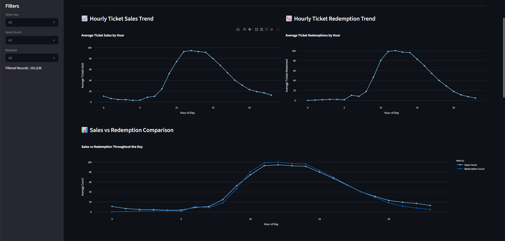
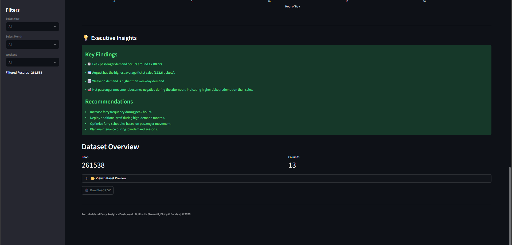

# ⛴️ Toronto Island Ferry Analytics Dashboard

An interactive Streamlit dashboard for analyzing Toronto Island Ferry ticket sales, passenger movement, and seasonal demand trends.

---

## 📌 Project Overview

This project analyzes historical Toronto Island Ferry ticket sales and redemption data to identify:

- Peak passenger demand hours
- Net passenger movement
- Seasonal demand patterns
- Weekend vs Weekday traffic
- Operational insights for ferry scheduling

The dashboard enables stakeholders to make data-driven decisions through interactive visualizations and KPI monitoring.

---

## 🎯 Objectives

- Analyze ticket sales and redemption trends
- Identify peak passenger flow windows
- Measure net passenger movement
- Compare weekday and weekend demand
- Analyze monthly and seasonal trends
- Support operational planning using data analytics

---

## 🚀 Features

- Interactive Streamlit Dashboard
- Dynamic KPI Cards
- Hourly Ticket Sales Analysis
- Hourly Ticket Redemption Analysis
- Sales vs Redemption Comparison
- Monthly Sales Trend
- Weekend vs Weekday Analysis
- Net Passenger Movement
- Executive Insights
- Dataset Preview
- Download Filtered Dataset

---

## 📊 Dashboard Preview

### Home Dashboard


---

### Analytics Dashboard



---

### Executive Insights



---

## 🛠 Technologies Used

- Python
- Streamlit
- Pandas
- Plotly
- NumPy

---

## 📂 Project Structure

```
Ferry_Analytics/
│
├── app.py
├── requirements.txt
├── README.md
├── .gitignore
│
├── data/
│   └── clean_ferry_dataset.csv
│
├── notebooks/
│   └── Ferry_EDA.ipynb
│
└── images/
    ├── dashboard_home.png
    ├── dashboard_charts.png
    └── dashboard_insights.png
```

---

## ⚙️ Installation

Clone the repository:

```bash
git clone https://github.com/yourusername/Ferry_Analytics.git
```

Move into the project directory:

```bash
cd Ferry_Analytics
```

Install dependencies:

```bash
pip install -r requirements.txt
```

Run the dashboard:

```bash
streamlit run app.py
```

---

## 📈 Key Insights

- Peak demand occurs around **12:00 PM**
- Highest monthly demand is observed during **August**
- Weekend demand exceeds weekday demand
- Net passenger movement varies significantly throughout the day
- Seasonal trends support optimized ferry scheduling

---

## 🔮 Future Improvements

- Real-time dashboard integration
- Passenger demand forecasting using Machine Learning
- Weather-based demand analysis
- Route-level analytics
- Live ferry scheduling recommendations

---

## 👨‍💻 Author

**Jeevith K**

Data Science Engineering Student

Built with ❤️ using Streamlit and Plotly.